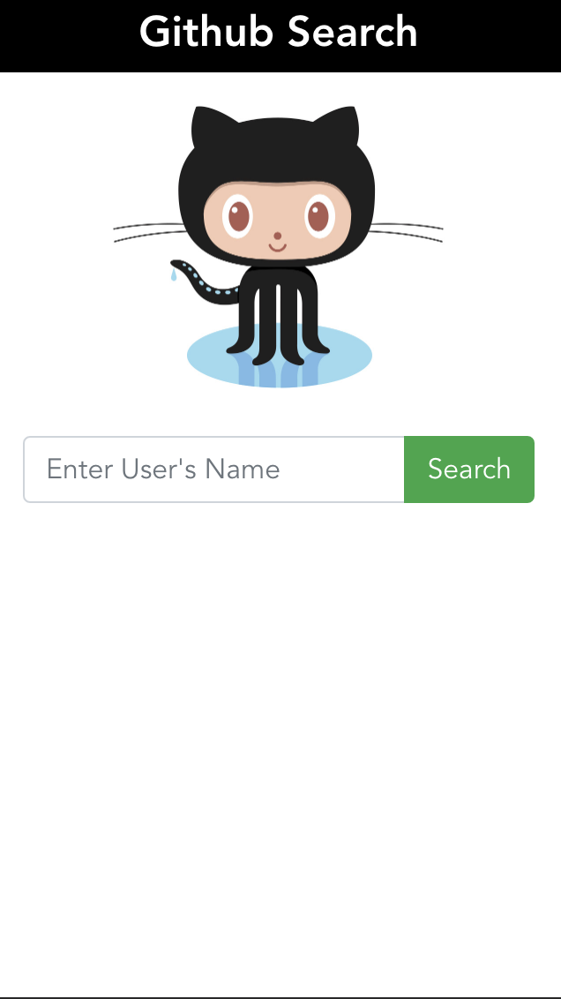

# mable-tech-test



Created with vue cli.

Includes: 
 - Vuex store
 - Router
 - PWA stuff
 - Webpack route split bundles
 - BootstrapVue

Example of The Mable Dev tech test given to applicants. Uses the Github API to search for users and return basic useer info (activity, repos, stars).

Taken around 3.5(ish) hrs in total.

Missing a few bits: Auth header on requests, tests for components, transitions between, error feedback to user.

## Project setup
```
npm install
```

### Compiles and hot-reloads for development
```
npm run serve
```

### Compiles and minifies for production
```
npm run build
```

### Run your unit tests
```
npm run test:unit
```

### Lints and fixes files
```
npm run lint
```
